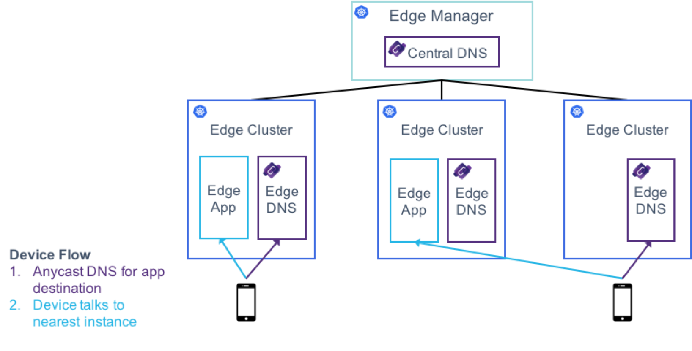

# Optikon DNS

Custom DNS for Optikon, Using Homemade CoreDNS Plugins

## Architecture

As you can see, optikon will run a CoreDNS instance at each edge site and the centralized cluster. We've written plugins found in this repo for `central` and `edge`, these each have different functions.

#### Central
The central DNS plugin is the brain that collects information from edge sites and distributes the larger picture. Central will have complete information as edge's will be reporting information to it every `n` seconds.

#### Edge
The edge DNS plugin reports what it knows about in its own cluster every `n` seconds. It also receives a table from the central DNS that provides it with information about other clusters outside of itself. This lets an edge CoreDNS instance capable of routing devices to applications not running in its own cluster (the device on the right)
