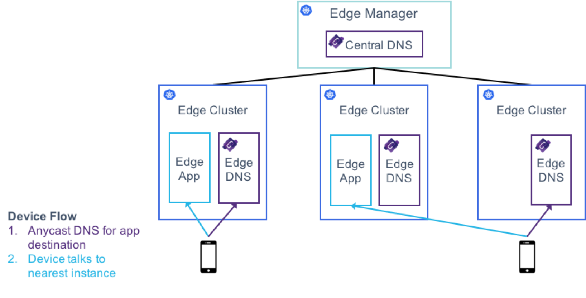

# Optikon DNS

Custom DNS for Optikon, Using Homemade CoreDNS Plugins

## Architecture

As shown above, Optikon DNS will run a CoreDNS instance at each edge and central cluster. This CoreDNS instance is custom built to use a homemade `edge` plugin to resolve Kubernetes service requests.

The `edge` plugin runs as part of a CDN-like hierarchical structure, where each `edge` DNS knows about the Kubernetes services running on its cluster, as well as the services running on all clusters "downstream" from it. This means that, whenever a DNS service request is made, the DNS will either resolve the request to itself, if it happens to be running that service, or it will try to determine the most proximate downstream cluster that is running the service, or if all else fails, it will forward the request upstream to see if clusters higher up in the hierarchy can resolve the request. If even the central-most clusters can't resolve the request, it will fall through to the CoreDNS `proxy` plugin using `8.8.8.8` by default.

For more information on the `edge` plugin, find the offical README under `plugin/edge`.
